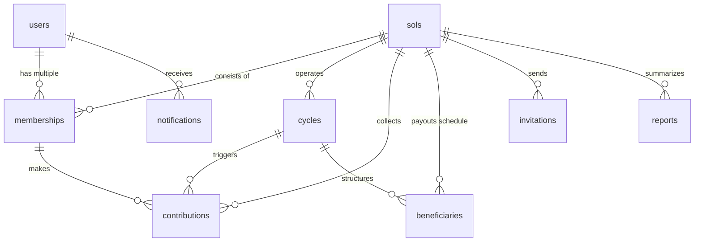

# FIREBASE COLLECTION RELATIONSHIP DIAGRAM

This document provides a visualization and logical map of the **SOL NoSQL Entity Relationships**. While Firestore is a non-relational document database, we maintain integrity through strict, consistent reference properties.

---

## 1. RELATIONSHIP VISUALIZATION (MERMAID)

The following Mermaid.js entity-relationship model represents our database design. It renders automatically in GitHub, VS Code, or any other compatible Markdown editor.

---

## 2. DETAIL ON REFERENTIAL RELATIONSHIPS

Because Firestore does not support automatic SQL-style table joins, we rely on standard reference variables (`solId`, `userId`, `cycleId`, `memberId`) stored within documents to establish logical links.

### Joint Mapping Directory:

| Source Collection | Target Collection | Foreign Key Property | Relationship Type | Join Verification Method |
| :--- | :--- | :--- | :---: | :--- |
| `users` | `memberships` | `userId` | $1 : N$ | Query `memberships` collection filtering by `userId == auth.uid`. |
| `sols` | `memberships` | `solId` | $1 : N$ | Query `memberships` collection filtering by `solId == currentSolId`. |
| `sols` | `cycles` | `solId` | $1 : N$ | Fetch cycles filtering by `solId == currentSolId` sorted by `cycleNumber`. |
| `cycles` | `contributions` | `cycleId` | $1 : N$ | Filter contributions where `cycleId == currentCycleId` to evaluate status. |
| `sols` | `beneficiaries` | `solId` | $1 : N$ | Query beneficiaries where `solId == currentSolId` ordered by `position`. |
| `users` | `notifications` | `userId` | $1 : N$ | Query notifications where `userId == auth.uid`. |
| `sols` | `reports` | `solId` | $1 : N$ | Filter historical analytics reports where `solId == currentSolId`. |

---

## 3. PRODUCTION PERFORMANCE OPTIMIZATION DESIGN

To minimize network latencies and client-side join complexity, we utilize selective data-denormalization:

1. **Cached Demographics in `memberships`:** Properties such as `name`, `email`, `phone`, and `avatarUrl` are cached inside the `memberships` document directly when a user joins a group. This allows a list of members to be fully rendered in a single collection query, avoiding the need to execute parallel "get user profile" fetch queries for every member card.
2. **Deterministic Keys for Memberships:** By enforcing `membershipId = "${userId}_${solId}"`, we can fetch any specific group subscription status using a single O(1) point lookup, completely eliminating expensive collection searches.
3. **Optimistic UI Updates:** Mutation layers in the frontend can immediately update local state matrices (such as updating a contribution's state from `pending` to `paid`) before Firestore returns a confirmation.
